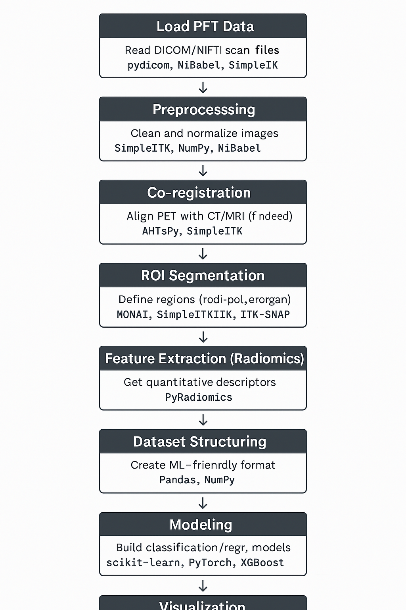

# 🧠 Postdoc Interview Prep: PET Imaging + Neuroendocrine Tumors (NETs)

## ✅ 1. Understand the Domain (PET + Neuroendocrine Tumors)

### 🔬 What is PET?
- **Positron Emission Tomography** is a functional imaging technique.
- Detects **metabolic and biochemical activity** using radiotracers.
- Radiotracers emit positrons → annihilate with electrons → produce gamma rays → image reconstruction.
- Functional (not anatomical) imaging — unlike CT or MRI.

---

### 🧬 PET Imaging in Neuroendocrine Tumors (NETs)
- NETs often **overexpress somatostatin receptors (SSTRs)**.
- Tracers like **Ga-68 DOTATATE** bind to these receptors, highlighting tumors.

#### 🎯 Common Tracers
| Tracer                     | Target NET Type            | Notes                                       |
|----------------------------|----------------------------|---------------------------------------------|
| **FDG (Fluorodeoxyglucose)** | Aggressive/high-grade NETs | Measures glucose metabolism                 |
| **Ga-68 DOTATATE/DOTATOC** | Well-differentiated NETs   | Binds somatostatin receptors (SSTR2)        |
| **F-18 DOPA**              | Pancreatic & midgut NETs   | Dopamine precursor, used for specific cases |

---

### 🧩 PET Data Characteristics
- Volumetric data `(x, y, z)` — sometimes with time/decay dimension.
- Common challenges:
  - **Low resolution**, noisy signals
  - **Co-registration** with CT/MRI
  - **SUV (Standardized Uptake Value)** quantification

---

### 🧪 Clinical & Research Goals
- **Tumor detection/localization**
- **Tumor grading** via SUV metrics
- **Treatment response** analysis
- **Prognosis & survival modeling**

---

### 🧠 PET + AI/ML Research Applications
- Tumor **segmentation** (DL models: UNet, attention)
- Lesion **classification**
- **Response prediction** using radiomics
- **Explainable AI** to support clinical decision-making

---

## ✅ 2. PET Data Workflow for Machine Learning

| **Step**                     | **Purpose**                                         | **Tools/Libraries**                            | **Notes**                                                                 |
|------------------------------|-----------------------------------------------------|------------------------------------------------|--------------------------------------------------------------------------|
| **1. Load PET Data**         | Read DICOM/NIfTI scan files                         | `pydicom`, `NiBabel`, `SimpleITK`              | Clinical (DICOM) or research (NIfTI) formats                             |
| **2. Preprocessing**         | Clean and normalize images                          | `SimpleITK`, `NumPy`, `NiBabel`                | Denoising, z-score/SUV normalization, voxel resampling                   |
| **3. Co-registration**       | Align PET with CT/MRI                               | `ANTsPy`, `SimpleITK`                          | Spatial alignment for multi-modal analysis                               |
| **4. ROI Segmentation**      | Identify regions (tumors/organs)                    | `MONAI`, `ITK-SNAP`, `SimpleITK`               | Manual or DL-based segmentation (e.g., 3D UNet)                           |
| **5. Feature Extraction**    | Extract quantitative descriptors                    | `PyRadiomics`                                  | Shape, texture, intensity, wavelet features                              |
| **6. Dataset Structuring**   | Format for ML modeling                              | `Pandas`, `NumPy`                              | Combine features and labels (classification/regression)                 |
| **7. Modeling**              | Train models for classification/regression          | `scikit-learn`, `PyTorch`, `XGBoost`           | Predict tumor grade, treatment outcomes                                  |
| **8. Evaluation/Explainability** | Assess performance & interpret results            | `SHAP`, `LIME`, `Captum`                       | Dice, AUC, saliency maps, feature attribution                            |
| **9. Visualization**         | Visualize scan slices and outputs                   | `matplotlib`, `SimpleITK.Show`, `ITKWidgets`   | Diagnostic plots, region overlays, saliency outputs                      |





---

## ✅ 3. Code Snippet: SUV Normalization + Visualization

```python
import nibabel as nib
import numpy as np
import matplotlib.pyplot as plt

# Load PET scan (NIfTI format)
img = nib.load('pet_scan.nii.gz')
data = img.get_fdata()

# Normalize (approximate SUV-style z-score normalization)
normalized = (data - np.mean(data)) / np.std(data)

# Plot middle slice
slice_idx = data.shape[2] // 2
plt.imshow(normalized[:, :, slice_idx], cmap='gray')
plt.title("Normalized PET Slice")
plt.axis('off')
plt.show()
```

---

## ✅ 4. Bonus: Deep Learning for PET Segmentation (Optional)

If segmentation is part of the project, mention:
- Framework: `MONAI` (medical imaging + PyTorch)
- Architecture: `3D UNet`, `Swin UNet`, or hybrid models
- Loss functions: `DiceLoss`, `CrossEntropy`, `FocalLoss`
- Metrics: Dice Coefficient, Hausdorff Distance

---

## ✅ 5. Research Alignment (PhD → PET)

### Relevant Skills from Your PhD
- **Policy Gradient, BPO, DPO** for preference-based optimization
- **Explainability** in model outputs (saliency, attribution)
- **Evaluation design** for aligning models to real-world success criteria

> "My PhD focused on aligning model behavior with human goals using reinforcement learning and evaluation metric design. I see direct parallels with PET imaging, where model performance must match diagnostic needs — not just accuracy metrics."

---

## ✅ 6. Technical Fit

| **Job Requirement**         | **Your Experience**                                           |
|----------------------------|---------------------------------------------------------------|
| Statistical analysis       | Python, R, MATLAB, `statsmodels`, `PyMC3`                     |
| Image/data pipelines       | NLP workflows + transferable data handling experience         |
| Programming & ML           | Python (expert), PyTorch, TensorFlow, Scikit-learn            |
| Research output            | Multiple NLP/ML papers (evaluation, RL, XAI)                  |
| Mentoring & communication  | Teaching assistant + industry leadership + stakeholder work   |

---

## ✅ 7. Tools & Libraries Checklist

### 📦 Core Python/Data Tools
- `NumPy`, `Pandas` – matrix/data ops
- `matplotlib`, `seaborn` – plots, heatmaps
- `statsmodels`, `scikit-learn`, `XGBoost` – stats + ML

### 🧠 Medical Imaging Tools
- `SimpleITK`, `NiBabel`, `pydicom` – reading, manipulating images
- `ITK-SNAP`, `MONAI` – segmentation
- `PyRadiomics` – radiomic feature extraction

### 🔍 Explainability
- `SHAP`, `LIME`, `Captum` – model interpretation
- `TensorBoard`, `MLflow` – logging, tracking

### ☁️ DevOps / Infra
- `Docker`, `Kubernetes`, `Git`, `CI/CD`
- `AWS`, `GCP`, `Azure`

---

## ✅ 8. Mock Project Walkthrough (STAR Format)

### 🔬 Project: Reward-Aware Text Generation (PhD, Transferable to Imaging)

**S – Situation**  
Standard metrics (BLEU/ROUGE) failed to align with human feedback in NLG.

**T – Task**  
Build a reward-optimized pipeline using human preference signals.

**A – Action**  
- Implemented `Policy Gradient`, `BPO`, `DPO`
- Created custom, task-specific evaluation metrics
- Built full PyTorch pipeline with modular RL training

**R – Result**  
20–30% improvement in human-rated quality.
> “This type of reward-aware optimization is highly transferable to PET analysis — especially in tasks like tumor classification, where domain-specific metrics like SUV distribution or false negatives are more critical than global accuracy.”

---

## ✅ 9. Conceptual Bridges (NLP ↔ PET)

### Similarities:
- Both involve **high-dimensional, noisy input**
- Require **custom evaluation metrics**
- Need **explainable, trustworthy models**
- Prefer **human-in-the-loop feedback** for alignment

> "I bring a mindset focused on **optimizing what matters** — not just what’s easy to measure."

---

## ✅ 10. Reading & Resource List

### PET Imaging
- [Radiopaedia – PET](https://radiopaedia.org/articles/positron-emission-tomography)
- [NIH Cancer Terms – PET Scan](https://www.cancer.gov/publications/dictionaries/cancer-terms/def/pet-scan)
- [IAEA Primer on PET](https://humanhealth.iaea.org/HHW/MedicalPhysics/NuclearMedicine/NuclearMedicineImaging/PET/index.html)

### Neuroendocrine Tumors
- [ACS – What is NET?](https://www.cancer.org/cancer/neuroendocrine-tumor/about/what-is-net.html)
- [PubMed – Ga-68 DOTATATE PET for NET](https://pubmed.ncbi.nlm.nih.gov/26101092/)

### AI in Medical Imaging
- [Radiomics Overview – Nature](https://www.nature.com/articles/nrclinonc.2015.141)
- [Deep Learning in PET Imaging – Review](https://pubmed.ncbi.nlm.nih.gov/32741878/)

---

