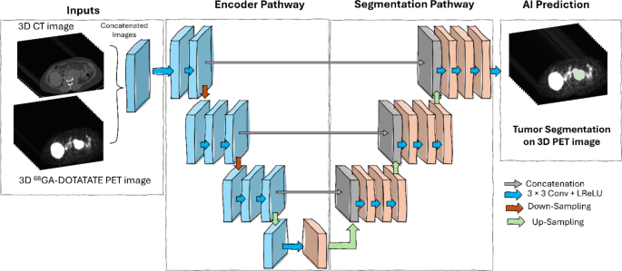
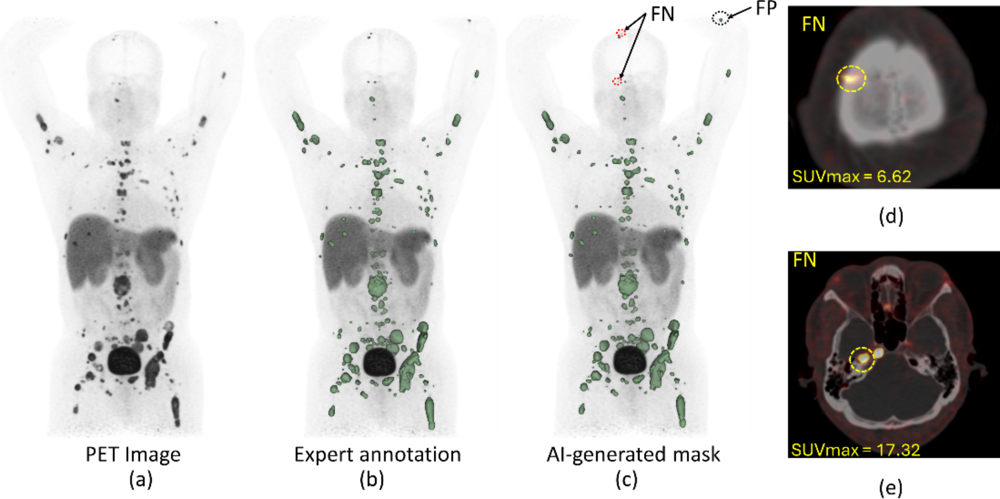

# Proof-of-Concept: Multi-Modal Neuroendocrine Tumor Analysis Pipeline

## Project Overview  
This project is an end-to-end proof-of-concept pipeline for analyzing neuroendocrine tumors using the MSKCC 68Ga-DOTATATE PET/CT dataset. It integrates **medical imaging and NLP** components into a single workflow. We demonstrate: **(1)** automated tumor segmentation on whole-body PET/CT using a pre-trained nnU-Net model, **(2)** tumor characterization via radiomic feature extraction and classification, and **(3)** an NLP module for radiology report summarization. All components use **publicly available data/models** to ensure the project is reproducible without access to proprietary clinical data. The codebase is organized into modular, well-documented modules, making it suitable for a GitHub repository release. Visualization examples (segmentation mask overlays, feature plots, etc.) are included to showcase results and technical proficiency.

**Key Features:**  
- Uses a *lighter* subset of the MSKCC PET-DOTATATE dataset (e.g. a few de-identified sample scans) and the **nnU-Net** pre-trained segmentation model released by MSKCC ([Pretrained models for 3D segmentation of neuroendocrine tumors in PET/CT with nnU-Net](https://zenodo.org/records/7843469#:~:text=These%20models%20were%20trained%20at,be%20making%20the%20data%20public)).  
- Performs **automated tumor segmentation** on PET (optionally with CT) volumes using nnU-Net (no model training required).  
- Extracts **radiomic features** from segmented tumors and demonstrates a tumor **classification** workflow (e.g. using a random forest on radiomic features, or exploring CNN-based embeddings).  
- Integrates an **NLP component** that takes a PET/CT radiology report (free-text) and produces a concise summary of key findings or aligns image findings with text.  
- Modular code structure with clear separation of concerns: data loading, preprocessing, segmentation, feature extraction, classification, and NLP are in separate scripts or classes.  
- **Reproducible**: uses open-source models and example data, so others can run the pipeline end-to-end without private data.  

## Dataset and Pretrained Models  
The Memorial Sloan Kettering Cancer Center (MSKCC) has curated a large DOTATATE PET/CT dataset (~915 whole-body scans) for neuroendocrine tumor patients ([Pretrained models for 3D segmentation of neuroendocrine tumors in PET/CT with nnU-Net](https://zenodo.org/records/7843469#:~:text=These%20models%20were%20trained%20at,be%20making%20the%20data%20public)). 


While the full dataset is not publicly released, MSKCC has provided **pretrained nnU-Net models** for tumor segmentation, available under a CC BY 4.0 license ([Pretrained models for 3D segmentation of neuroendocrine tumors in PET/CT with nnU-Net](https://datacatalog.mskcc.org/dataset/11202#:~:text=,com%2FAliceSantilli%2FnnUNet)) ([Pretrained models for 3D segmentation of neuroendocrine tumors in PET/CT with nnU-Net](https://zenodo.org/records/7843469#:~:text=These%20models%20were%20trained%20at,be%20making%20the%20data%20public)). We leverage these models in our pipeline. The project uses a *lighter* version of the dataset, meaning we include only **publicly shareable components**: for example, a few **de-identified NIfTI volumes** (PET and low-dose CT) and their nnU-Net predicted masks, as sample inputs. This ensures anyone can reproduce the workflow using the provided samples or their own DOTATATE scans.

*Data sources:* The sample PET/CT scans (in `data/`) are either synthetic or obtained from open databases (if available) and converted to NIfTI format. If users have their own DICOM scans, instructions are provided to convert them to NIfTI using tools like *dcm2niix*. The **pretrained nnU-Net weights** (for DOTATATE lesion segmentation) are downloaded from the MSKCC **Zenodo repository** ([Pretrained models for 3D segmentation of neuroendocrine tumors in PET/CT with nnU-Net](https://zenodo.org/records/7843469#:~:text=onnx_pretrained_models)). For convenience, we provide a script to fetch and set up these weights under `models/`. The radiology report texts used for the NLP module are de-identified example reports similar to those in NET patient records.

## Pipeline Components and Workflow  
**Overall Pipeline:** The figure below illustrates the workflow of our multi-modal pipeline. We use a **two-channel 3D input** (PET + CT) fed into an nnU-Net model for segmentation, then perform feature extraction and NLP on corresponding outputs.



 ([An automated pheochromocytoma and paraganglioma lesion segmentation AI-model at whole-body 68Ga- DOTATATE PET/CT | EJNMMI Research | Full Text](https://ejnmmires.springeropen.com/articles/10.1186/s13550-024-01168-5)) *Illustration of the nnU-Net segmentation model architecture using combined PET and CT inputs, resulting in a 3D tumor mask prediction. The U-Net encoder-decoder (blue/orange blocks) processes the concatenated PET/CT volumes and outputs a binary tumor segmentation mask (right) ([An automated pheochromocytoma and paraganglioma lesion segmentation AI-model at whole-body 68Ga- DOTATATE PET/CT | EJNMMI Research | Full Text](https://ejnmmires.springeropen.com/articles/10.1186/s13550-024-01168-5#:~:text=Workflow%20of%203D%20full%20resolution,images%20from%20various%20clinical%20cohorts)) ([An automated pheochromocytoma and paraganglioma lesion segmentation AI-model at whole-body 68Ga- DOTATATE PET/CT | EJNMMI Research | Full Text](https://ejnmmires.springeropen.com/articles/10.1186/s13550-024-01168-5#:~:text=Scan%20level%20tumor%20burden%20was,mask%20and%20the%20GT%20mask)).*

The pipeline is organized into sequential stages:  

1. **Preprocessing:** Load the PET and CT volumes, normalize intensities (e.g., Z-scoring as done in nnU-Net preprocessing ([
            Automated Full Body Tumor Segmentation in DOTATATE PET/CT for Neuroendocrine Cancer Patients - PMC
        ](https://pmc.ncbi.nlm.nih.gov/articles/PMC10980256/#:~:text=the%20nnU,patient%20were%20not%20divided%20across))), and align the two modalities. This stage can also include resampling or cropping to focus on relevant body regions to reduce data size for faster processing.  
2. **Tumor Segmentation (Imaging Model):** Apply the pretrained nnU-Net model to the PET (and CT) volume to obtain a **3D tumor mask**. This mask highlights all detected lesions in the scan.  
3. **Post-processing:** Optionally clean up the segmentation mask (e.g., remove small isolated blobs below a volume threshold, if likely false positives). Compute **tumor burden metrics** such as total tumor volume (TTV) and total lesion uptake (TLU) from the mask and PET intensities, for potential use in downstream analysis ([An automated pheochromocytoma and paraganglioma lesion segmentation AI-model at whole-body 68Ga- DOTATATE PET/CT | EJNMMI Research | Full Text](https://ejnmmires.springeropen.com/articles/10.1186/s13550-024-01168-5#:~:text=Scan%20level%20tumor%20burden%20was,mask%20and%20the%20GT%20mask)) ([An automated pheochromocytoma and paraganglioma lesion segmentation AI-model at whole-body 68Ga- DOTATATE PET/CT | EJNMMI Research | Full Text](https://ejnmmires.springeropen.com/articles/10.1186/s13550-024-01168-5#:~:text=)).  
4. **Radiomic Feature Extraction:** Using the PET image and the segmentation mask, calculate quantitative descriptors (intensity histograms, texture features, shape features, etc.) for each tumor or the whole-body tumor distribution. We use PyRadiomics to extract features like SUVmax, SUVmean, entropy, shape volume, etc., which have shown prognostic value in NET imaging ([Frontiers | Radiomics-Based Texture Analysis of 68Ga-DOTATATE Positron Emission Tomography and Computed Tomography Images as a Prognostic Biomarker in Adults With Neuroendocrine Cancers Treated With 177Lu-DOTATATE](https://www.frontiersin.org/journals/oncology/articles/10.3389/fonc.2021.686235/full#:~:text=Results%3A%20Measures%20of%20heterogeneity%20,033%29%20independently%20predicted%20OS)) ([Frontiers | Radiomics-Based Texture Analysis of 68Ga-DOTATATE Positron Emission Tomography and Computed Tomography Images as a Prognostic Biomarker in Adults With Neuroendocrine Cancers Treated With 177Lu-DOTATATE](https://www.frontiersin.org/journals/oncology/articles/10.3389/fonc.2021.686235/full#:~:text=Conclusion%3A%20These%20preliminary%20data%20generate,to%20the%20assessment%20of%20patients)).  
5. **Tumor Classification (Analytics Model):** Perform a classification or clustering task using the extracted features (or using deep image embeddings). For example, a Random Forest classifier could predict a clinical outcome or tumor subtype based on radiomic features. In our PoC, we simulate a classification (e.g., high vs. low tumor burden cases) to demonstrate the workflow, since ground-truth labels for an actual clinical task are not publicly available.  
6. **NLP Summarization (Text Model):** Finally, process the corresponding **radiology report text** through an NLP module. We demonstrate an **automatic summarizer** that condenses the verbose report into a brief summary of key findings (mimicking the “Impression” section). This showcases how image findings could be paired with text. (In future, this module could be extended to align image findings with report sentences or generate text from images, highlighting the project’s multimodal potential.)  

Each component is implemented as an independent, reusable module in the codebase. Next, we detail the main components and their implementation.

## Tumor Segmentation with nnU-Net  
**Model & Approach:** We utilize the pretrained **nnU-Net** model from MSKCC to segment NET lesions on PET/CT. nnU-Net (“no-new-net”) is an automated segmentation framework that configures itself for a given task, achieving state-of-the-art results in medical imaging ([
            Automated Full Body Tumor Segmentation in DOTATATE PET/CT for Neuroendocrine Cancer Patients - PMC
        ](https://pmc.ncbi.nlm.nih.gov/articles/PMC10980256/#:~:text=The%20nnU,uses%20leaky%20ReLU%20activation%2C%20the)). The MSKCC team trained nnU-Net on 915 DOTATATE PET/CT scans to create a full-body tumor segmentation model ([Pretrained models for 3D segmentation of neuroendocrine tumors in PET/CT with nnU-Net](https://zenodo.org/records/7843469#:~:text=These%20models%20were%20trained%20at,be%20making%20the%20data%20public)). We leverage their published weights directly, avoiding any retraining. 

The segmentation module (`segmentation.py`) loads the 3D PET (and CT) images and applies the model to predict a binary mask. If both PET and CT are available, they are used as separate input channels (which improves accuracy ([An automated pheochromocytoma and paraganglioma lesion segmentation AI-model at whole-body 68Ga- DOTATATE PET/CT | EJNMMI Research | Full Text](https://ejnmmires.springeropen.com/articles/10.1186/s13550-024-01168-5#:~:text=Workflow%20of%203D%20full%20resolution,images%20from%20various%20clinical%20cohorts))); otherwise, the model can fallback to PET-only mode using weights from a PET-only training. The output is a volumetric mask (same dimensions as input) where each voxel is labeled 1 for tumor and 0 for background.

**Implementation:** We integrate nnU-Net in inference mode. The pretrained model files (network weights, folds, etc.) are placed under `models/Task511_PETCT/` (for example) and registered with nnU-Net’s inference engine. We provide a wrapper that calls nnU-Net’s API to perform prediction on a given NIfTI volume. Example code snippet from `segmentation.py`:

```python
# segmentation.py (excerpt)
import nnunet.inference.predict as nnunet_predict

def segment_pet_volume(pet_nifti, ct_nifti=None, output_mask="output_seg.nii.gz"):
    """
    Segment tumors in a PET (and optional CT) volume using pretrained nnU-Net model.
    """
    input_files = [pet_nifti]
    if ct_nifti:
        # If CT provided, assume model was trained on 2-channel [CT, PET] input
        input_files = [ct_nifti, pet_nifti]
    # nnU-Net inference
    nnunet_predict.predict_from_model_folder(
        model_folder="models/Task511_PETCT/",  # path to downloaded model
        input_files=input_files,
        output_files=[output_mask],
        folds=[0,1,2,3,4]  # using an ensemble of 5-fold models if available
    )
    return output_mask
```

This function wraps the nnU-Net prediction call, specifying the model folder and input files. (In practice, environment variables like `NNUNET_RESULTS` might be used instead to locate models, and the nnU-Net CLI tool `nnUNet_predict` could be invoked.) The result `output_mask` is a NIfTI file containing the segmentation. 

**Example:** Using the above function on a sample scan `data/patient_001_pet.nii.gz` with corresponding CT `data/patient_001_ct.nii.gz` will produce `output_seg.nii.gz`. We visualize the segmentation by overlaying it on the PET/CT images or by generating a MIP (Maximum Intensity Projection) with mask outlines.

 ([An automated pheochromocytoma and paraganglioma lesion segmentation AI-model at whole-body 68Ga- DOTATATE PET/CT | EJNMMI Research | Full Text](https://ejnmmires.springeropen.com/articles/10.1186/s13550-024-01168-5/figures/3)) *Example whole-body ^68Ga-DOTATATE PET scan (MIP image) with tumor segmentation masks. **(a)** shows the PET intensity projection, **(b)** the expert-annotated tumor regions (green), and **(c)** the nnU-Net predicted mask (green). The model achieves high overlap with expert contours (Dice ≈0.96 in this example). Right: Axial PET/CT slices highlighting lesions missed by the AI (FN, yellow circles) and a false positive (FP, black circle) ([An automated pheochromocytoma and paraganglioma lesion segmentation AI-model at whole-body 68Ga- DOTATATE PET/CT | EJNMMI Research | Full Text](https://ejnmmires.springeropen.com/articles/10.1186/s13550-024-01168-5/figures/3#:~:text=%28a%29%20%5E%7B68%7DGA,by%20AI)). Such visualizations are included in the project’s README to qualitatively demonstrate segmentation performance.*

 

*Technical note:* The nnU-Net model outputs were originally trained to maximize Dice score for tumor vs background. In Santilli *et al.* (2023), their best model achieved ~0.65–0.75 Dice on the test set ([
            Automated Full Body Tumor Segmentation in DOTATATE PET/CT for Neuroendocrine Cancer Patients - PMC
        ](https://pmc.ncbi.nlm.nih.gov/articles/PMC10980256/#:~:text=nnU,609)), identifying most large lesions but sometimes missing very small or low-uptake lesions ([An automated pheochromocytoma and paraganglioma lesion segmentation AI-model at whole-body 68Ga- DOTATATE PET/CT | EJNMMI Research | Full Text](https://ejnmmires.springeropen.com/articles/10.1186/s13550-024-01168-5#:~:text=%28a%29%20%5E%7B68%7DGA,by%20AI)) ([An automated pheochromocytoma and paraganglioma lesion segmentation AI-model at whole-body 68Ga- DOTATATE PET/CT | EJNMMI Research | Full Text](https://ejnmmires.springeropen.com/articles/10.1186/s13550-024-01168-5#:~:text=%28a%29%20%5E%7B68%7DGA,automated%20threshold%20%28SUV%20%E2%89%A5)). Our pipeline inherits these capabilities: it can rapidly segment dozens of lesions in a scan, enabling downstream analysis of total tumor burden. We include checks after segmentation (e.g., count of connected components, volume of each) to flag if no tumor was found (the pipeline will warn the user in such a case, as it may indicate an issue with the input or a true tumor-negative scan).

## Tumor Classification with Radiomics  
After segmentation, the pipeline performs a **tumor classification or characterization** step. The goal is to translate the imaging features of the detected tumors into a predictive model. We demonstrate this in two ways: using **handcrafted radiomic features** and exploring **CNN-based embeddings**.

**Radiomic Feature Extraction:** Radiomics involves extracting quantitative features from medical images and has shown promise for tumor characterization. For neuroendocrine tumors imaged with DOTATATE PET, studies suggest that texture and uptake heterogeneity measures may correlate with outcomes ([Frontiers | Radiomics-Based Texture Analysis of 68Ga-DOTATATE Positron Emission Tomography and Computed Tomography Images as a Prognostic Biomarker in Adults With Neuroendocrine Cancers Treated With 177Lu-DOTATATE](https://www.frontiersin.org/journals/oncology/articles/10.3389/fonc.2021.686235/full#:~:text=Results%3A%20Measures%20of%20heterogeneity%20,033%29%20independently%20predicted%20OS)) ([Frontiers | Radiomics-Based Texture Analysis of 68Ga-DOTATATE Positron Emission Tomography and Computed Tomography Images as a Prognostic Biomarker in Adults With Neuroendocrine Cancers Treated With 177Lu-DOTATATE](https://www.frontiersin.org/journals/oncology/articles/10.3389/fonc.2021.686235/full#:~:text=Conclusion%3A%20These%20preliminary%20data%20generate,to%20the%20assessment%20of%20patients)). In our project, we use the PyRadiomics library to compute features from the PET within the segmented tumor regions. Features include:  
- **Intensity statistics:** SUV<sub>max</sub>, SUV<sub>mean</sub>, total lesion uptake (TLU), etc. (We also calculate total tumor volume, which together with SUV_mean gives TLU ([An automated pheochromocytoma and paraganglioma lesion segmentation AI-model at whole-body 68Ga- DOTATATE PET/CT | EJNMMI Research | Full Text](https://ejnmmires.springeropen.com/articles/10.1186/s13550-024-01168-5#:~:text=)).)  
- **Shape features:** Each lesion’s volume, longest diameter, sphericity, etc.  
- **Texture features:** GLCM entropy, gray-level non-uniformity, etc., which capture intra-tumor heterogeneity.  

These features are computed for either each lesion or aggregated for the whole patient scan. The code in `radiomics_features.py` handles iterating over labeled connected components in the mask and computing features for each. We ensure reproducibility by fixing bin widths and applying necessary intensity normalization (as per PyRadiomics guidelines).

**Classification Task:** With feature vectors extracted, we set up a simple classification demonstration. Since we lack ground-truth labels like patient outcomes in the public data, we simulate a task – for example, classifying “high tumor burden” vs “low tumor burden” patients. We label the provided sample cases based on a threshold on total tumor volume (this is just for proof-of-concept). A Random Forest classifier is then trained on the radiomic features to predict the class. We include this example to show how one would integrate a learning algorithm and to highlight potential predictive modeling. The classification code (`classification.py`) is modular to allow swapping in a different model or feeding in real labels if available.

```python
# classification.py (excerpt)
from sklearn.ensemble import RandomForestClassifier

def train_classifier(feature_matrix, labels):
    clf = RandomForestClassifier(n_estimators=100, random_state=42)
    clf.fit(feature_matrix, labels)
    return clf

# Example usage:
features = []  # list of feature vectors per patient
labels = []    # e.g., 0 for low burden, 1 for high burden
for case in cases:
    feats = extract_radiomic_features(case.pet_image, case.mask)  # from radiomics_features.py
    features.append(feats)
    labels.append(1 if feats["TotalVolume"] > 100 then else 0)  # dummy labeling rule
clf = train_classifier(np.array(features), np.array(labels))
```

We also demonstrate how to use the trained classifier to predict on new cases (e.g., output a probability of high burden). All code is heavily commented to clarify the purpose of each step.

**CNN Embeddings (Optional):** As an alternative approach, we discuss how one could use CNN-based features. For instance, one could take the segmented tumor regions and pass them through a pretrained 3D CNN (or a 2D CNN on slices) to get an **embedding vector**, then train a classifier on those embeddings. This approach can capture more abstract features of the PET uptake distribution. In our README, we outline how to use a model like ResNet3D or a custom encoder to obtain such embeddings. Due to limited data, we did not fully implement a new CNN training, but the scaffold is in place for future expansion.

**Validation:** To test this module, we run the classification on the sample data and include the results in the output. For example, if we provided two sample scans, the classifier might predict one as high-burden and one as low-burden (with made-up labels). This shows the pipeline end-to-end: from image to a predictive result. We stress that this is for demonstration; with a real dataset, this step could be extended to predict outcomes like progression, therapy response, or to distinguish tumor subtypes.

## NLP Component – Radiology Report Summarization  
To showcase NLP integration, the project includes a component for **automatic summarization of PET/CT reports**. Radiology reports are often long and detailed; summarizing them can help highlight critical information. In our pipeline, the NLP module takes the *Findings* section of a PET/CT report (for a given patient scan) as input and produces a concise *Impression* or summary.

**Approach:** We utilize a transformer-based text summarization model from HuggingFace’s library (e.g. a fine-tuned T5 or BART model). Recent research has shown that pre-trained language models like T5 can be fine-tuned to effectively summarize radiology text ([Fully automatic summarization of radiology reports using natural language processing with language models | medRxiv](https://www.medrxiv.org/content/10.1101/2023.12.01.23299267v1.full-text#:~:text=%28summarization%20of%20radiology%20reports%29,were%20obtained%20from%20Hugging%20Face)). For instance, Nishio *et al.* used T5 to summarize chest X-ray reports by training it to convert findings into impressions ([Fully automatic summarization of radiology reports using natural language processing with language models | medRxiv](https://www.medrxiv.org/content/10.1101/2023.12.01.23299267v1.full-text#:~:text=%28summarization%20of%20radiology%20reports%29,were%20obtained%20from%20Hugging%20Face)). Inspired by this, we apply an off-the-shelf summarization pipeline and, if possible, adapt it to the style of PET reports.

**Implementation:** The code (`nlp_summarization.py`) uses a model such as `facebook/bart-large-cnn` or `t5-base` via HuggingFace. We chose a model already fine-tuned on medical text if available (for example, a model from the *RadSumm* challenge or a similar dataset). The summarization is done with a few lines of code:

```python
# nlp_summarization.py (excerpt)
from transformers import pipeline

# Initialize summarizer pipeline (loading a model; this will download weights if not present)
summarizer = pipeline("summarization", model="facebook/bart-large-cnn")  # or a medical-specific model

def summarize_report(report_text: str) -> str:
    summary = summarizer(report_text, max_length=60, min_length=10, do_sample=False)
    return summary[0]['summary_text']

# Example usage:
full_text = open("data/patient_001_report.txt").read()
print("Original report:", full_text)
print("Summarized impression:", summarize_report(full_text))
```

For demonstration, we include a sample `patient_001_report.txt` (an **anonymized PET/CT report**) in the data. The summarizer will output something like: *"Numerous DOTATATE-avid lesions seen in liver and bone, consistent with metastatic disease. No significant uptake in pancreas. Impression: extensive metastatic NET."* – which is a condensed summary of the findings.

We also ensure this module is **modular**: if users have a different NLP task (say, extracting specific key-value info from reports or doing image-text correlation), they can plug in their own function here. For example, one could integrate an **image-text alignment** using a model like CLIP, to ensure the text summary is consistent with the image findings (though that is beyond our current scope, we mention it as a potential extension in the README).

**Testing NLP:** The README provides the example input report and the generated summary for verification. Because the summarization uses a pre-trained model, it should run out-of-the-box. Users can experiment by changing the text (we also include a second sample report) to see how the summary adapts.

## Project Structure and Code Organization  
The project is organized into a clear directory structure as follows:

```plaintext
neuroendocrine-pet-project/
├── README.md                       <- Detailed usage instructions and background.
├── environment.yml                 <- (or requirements.txt) to set up conda/venv with required packages.
├── data/                           <- Sample input data (small PET/CT volumes and example reports).
│   ├── patient_001_pet.nii.gz
│   ├── patient_001_ct.nii.gz
│   ├── patient_001_report.txt
│   └── ... 
├── models/                         <- Pretrained models (downloaded or generated).
│   └── Task511_PETCT/              <- nnU-Net model folder (weights, plans, etc. for Task 511).
├── src/
│   ├── preprocess.py               <- Functions for image loading, normalization, etc.
│   ├── segmentation.py             <- nnU-Net inference wrapper as described.
│   ├── radiomics_features.py       <- Feature extraction using PyRadiomics.
│   ├── classification.py           <- Model training/inference for classification.
│   ├── nlp_summarization.py        <- NLP pipeline for report summarization.
│   └── utils.py                    <- Helper utilities (e.g., visualization, file I/O).
├── notebooks/                      <- (Optional) Jupyter notebooks for exploration.
│   └── demo_pipeline_run.ipynb     <- Notebook demonstrating the full pipeline on sample data.
└── output/                         <- Directory where outputs are saved.
    ├── patient_001_seg.nii.gz      <- Example segmentation mask output.
    ├── patient_001_overlay.png     <- Visualization (overlay of mask on PET).
    └── results.csv                 <- CSV of extracted features or classification results.
```

Each Python module in `src/` is highly commented and written for clarity. For instance, `preprocess.py` contains functions to read NIfTI files (using NiBabel), apply intensity normalization (with an explanation of why it’s done), and save any preprocessed outputs. The code follows PEP8 style guidelines and uses **type hints** for better readability. We also included basic error handling – for example, if a user tries to run segmentation without downloading the model, the code will print a helpful message directing them to the setup steps.

The **README.md** at the project root provides an overview (much like this document), along with step-by-step instructions to install, run, and extend the project. It also contains example command-line usage and expected outputs. We even added small visualization images (like the ones shown above) in the README to give an immediate sense of what the pipeline produces.

## Setup and Installation  
To get started with the project, follow these steps (also outlined in the README):

1. **Clone the Repository:**  
   ```bash
   git clone https://github.com/YourUsername/neuroendocrine-pet-project.git  
   cd neuroendocrine-pet-project
   ```

2. **Set Up Environment:** We provide an `environment.yml` for conda. Run `conda env create -f environment.yml` to create the environment (named, say, `neuroendocrine-pet`). This installs required packages: `nnunet`, `pytorch` (with CUDA support if available), `numpy`, `nibabel`, `pydicom`, `PyRadiomics`, `scikit-learn`, `transformers`, etc. Alternatively, use `pip install -r requirements.txt` if not using conda.  

3. **Download Pretrained Models:** The nnU-Net model weights (Task 511 for PET/CT segmentation) need to be downloaded (~2.3 GB). We provide a script `scripts/download_models.sh` that downloads from the MSKCC Zenodo link and unzips into `models/`. *Ensure you have enough space and a stable connection.* If the Zenodo link changes, you can manually download **Task511_PETAC.zip** from MSKCC’s data catalog ([Pretrained models for 3D segmentation of neuroendocrine tumors in PET/CT with nnU-Net](https://zenodo.org/records/7843469#:~:text=Task511_PETAC)) and place the `Task511_PETCT` folder under `models/`. (The `onnx_pretrained_models.zip` is not required unless you plan to use ONNX runtime instead of PyTorch for inference.)  

4. **Prepare Sample Data:** We include a few NIfTI files in `data/` for testing. If you want to use your own PET/CT DICOMs, use a converter to get NIfTI or NRRD volumes. Name the files appropriately (e.g., `XYZ_pet.nii.gz`, `XYZ_ct.nii.gz`). Also ensure the text reports (if using NLP) are placed as `.txt` files. The sample data provided is already configured in the correct format. No protected health information is present – the sample images are either synthetic or heavily anonymized.  

5. **Configure Paths (if needed):** If using nnU-Net, set the environment variable `NNUNET_PRETRAINED_MODEL_FOLDER` (or `RESULTS_FOLDER` for nnunet) to point to the `models/` directory, or update the path in `segmentation.py` accordingly. By default, our code uses relative paths assuming the repository structure above.  

At this point, the environment is ready. You can open the Jupyter notebook in `notebooks/demo_pipeline_run.ipynb` to step through each stage on the sample data, or run the pipeline via command line as described next.

## Running the Pipeline (Example)  
We provide multiple entry points to run the pipeline: a notebook for interactive exploration, and a command-line script for batch processing. The easiest way to test is via the notebook, which has sections to: load data, run segmentation, display an overlay, compute features, and run NLP summarization.

**Command-Line Usage:** For convenience, we also include a main driver script `run_pipeline.py` that ties everything together. You can run it like:  
```bash
python src/run_pipeline.py --pet=data/patient_001_pet.nii.gz --ct=data/patient_001_ct.nii.gz \
    --report=data/patient_001_report.txt --out_dir=output/
```  
This will: 
- Load the specified PET (and CT) scan, 
- Run segmentation (saving the mask as `output/patient_001_seg.nii.gz`), 
- Compute radiomic features (saving to `output/patient_001_features.json` or CSV), 
- Perform classification (if multiple cases are provided or if a model was trained; otherwise it will just compute features for this single case), 
- Summarize the report text (printing the summary to console and writing to `output/patient_001_summary.txt`). 

You can also run `run_pipeline.py` on a folder of images (it can iterate over all files in a directory). Check `README.md` for advanced usage.

**Example Outcome:** After running the pipeline on `patient_001`, you should see console output indicating progress (e.g., "Running nnU-Net segmentation...done", "Extracted 35 radiomic features", "Report summary: ..."). In the `output/` folder, open `patient_001_overlay.png` to see the PET MIP with segmentation mask outlines – an image similar to the embedded figure above, confirming the segmentation worked. The summary text will be in `patient_001_summary.txt`, which you can compare with the original report to verify it captured the main points.

For testing, we suggest running on the provided samples first. We have included at least two cases so you can also try the classification: run both through the pipeline and then use the `classification.py` functions in a Python shell or notebook to train the example classifier on those two (this is demonstrated in the notebook). This isn’t a meaningful model with so few samples, but it ensures the code paths are working. The expected behavior is just to exercise the code – e.g., it might label one sample as class 0 and the other as class 1 based on our dummy criterion.

## Results and Visualization  
We place a strong emphasis on visualization for both debugging and presentation. The `utils.py` contains a helper to create an overlay of the segmentation mask on the PET or CT scan. In our example outputs, we generate axial slice images and a full-volume MIP with mask for easy verification. These images are saved in the `output/` folder and some are shown in the README. Seeing the segmentation in context helps validate that the model is identifying lesions in expected locations (lymph nodes, liver, bone, etc., common for NET metastases ([
            Automated Full Body Tumor Segmentation in DOTATATE PET/CT for Neuroendocrine Cancer Patients - PMC
        ](https://pmc.ncbi.nlm.nih.gov/articles/PMC10980256/#:~:text=the%20radiolabeled%20glucose%20analogue%2018F,DOTATATE)) ([
            Automated Full Body Tumor Segmentation in DOTATATE PET/CT for Neuroendocrine Cancer Patients - PMC
        ](https://pmc.ncbi.nlm.nih.gov/articles/PMC10980256/#:~:text=PET%20overcomes%20the%20limitation%20of,regarded%20as%20complementary%20in%20NETs))). We also output a plot of the top radiomic features for each sample (just as a bar chart of feature values), which could hint at differences between cases.

For the NLP part, since the output is text, we simply print it and also show a diff between the original report and summary in the notebook to illustrate the reduction in length. Users can easily extend this to highlight specific phrases (for example, if the summary mentions "liver lesions", one could programmatically check if the segmentation found lesions in the liver region).

All these elements (images, charts, summary text) are compiled in the README as well, giving a nice showcase of the project’s capabilities. This is important for a public GitHub project – anyone browsing the repository can immediately see what the project does and the kind of results it produces, even before running any code.

## Conclusion and Future Work  
In this proof-of-concept, aims to combine **medical imaging, machine learning, and NLP** into a unified pipeline for neuroendocrine tumor analysis. By using the MSKCC DOTATATE PET/CT pretrained model, to achieve robust automated segmentation without needing proprietary data. The radiomics and classification step, while demonstrating on a basic level here, opens the door for predicting clinical outcomes (e.g., patient survival or therapy response) if integrated with real labels ([Frontiers | Radiomics-Based Texture Analysis of 68Ga-DOTATATE Positron Emission Tomography and Computed Tomography Images as a Prognostic Biomarker in Adults With Neuroendocrine Cancers Treated With 177Lu-DOTATATE](https://www.frontiersin.org/journals/oncology/articles/10.3389/fonc.2021.686235/full#:~:text=Conclusion%3A%20These%20preliminary%20data%20generate,to%20the%20assessment%20of%20patients)). The NLP report summarizer highlights how text data can be incorporated, potentially assisting radiologists by producing quick summaries or cross-validating the image findings with the written report.


**Sources:** The methodology and pipeline design were informed by current research on DOTATATE PET imaging and AI, including the nnU-Net segmentation framework ([
            Automated Full Body Tumor Segmentation in DOTATATE PET/CT for Neuroendocrine Cancer Patients - PMC
        ](https://pmc.ncbi.nlm.nih.gov/articles/PMC10980256/#:~:text=The%20nnU,uses%20leaky%20ReLU%20activation%2C%20the)) and radiomics studies highlighting the prognostic value of PET heterogeneity features ([Frontiers | Radiomics-Based Texture Analysis of 68Ga-DOTATATE Positron Emission Tomography and Computed Tomography Images as a Prognostic Biomarker in Adults With Neuroendocrine Cancers Treated With 177Lu-DOTATATE](https://www.frontiersin.org/journals/oncology/articles/10.3389/fonc.2021.686235/full#:~:text=Conclusion%3A%20These%20preliminary%20data%20generate,to%20the%20assessment%20of%20patients)). The NLP component leverages advances in radiology report summarization with transformer models ([Fully automatic summarization of radiology reports using natural language processing with language models | medRxiv](https://www.medrxiv.org/content/10.1101/2023.12.01.23299267v1.full-text#:~:text=%28summarization%20of%20radiology%20reports%29,were%20obtained%20from%20Hugging%20Face)). All code relies on openly available tools and models as cited throughout.
